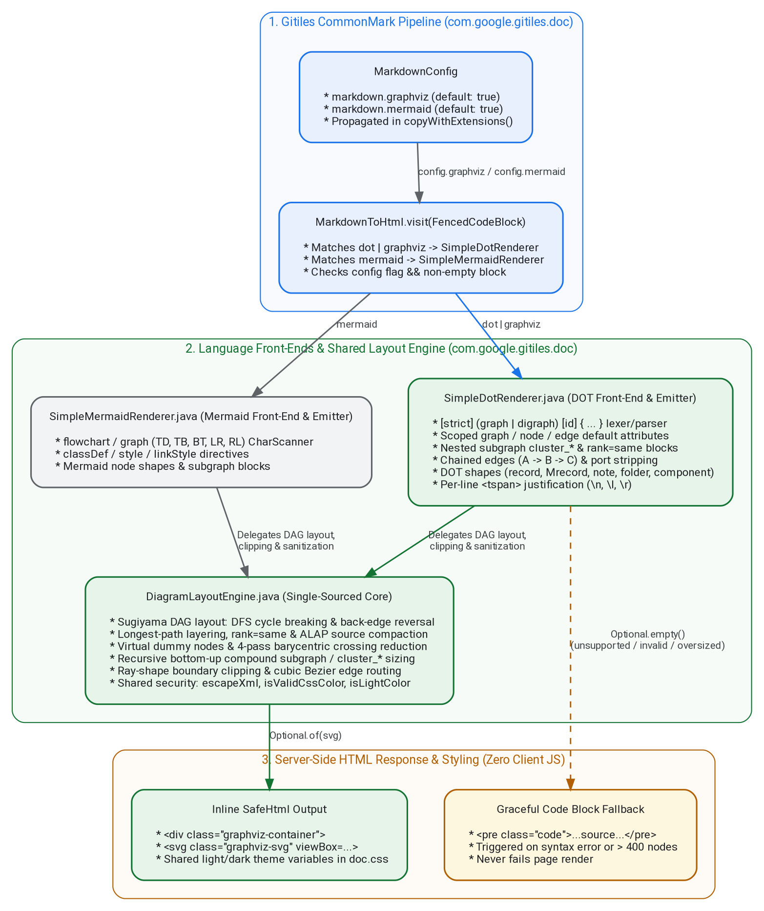

# Server-Side Graphviz DOT Rendering in Gitiles

[TOC]

## Objective

Add server-side rendering of fenced Graphviz DOT code blocks (```` ```dot ```` and
```` ```graphviz ````) to inline `<svg>` diagrams in Gitiles Markdown
documentation without adding any new external Java, native binary, or
client-side JavaScript/WebAssembly dependencies.

## Background

Engineering documentation and design specifications hosted in Gitiles
repositories frequently embed architecture diagrams, state machines, and
dependency graphs authored in the Graphviz DOT language.

Gitiles already renders fenced ```` ```mermaid ```` blocks server-side via
`SimpleMermaidRenderer.java` using a self-contained Java parser, Sugiyama
hierarchical DAG layout engine, and sanitized SVG emitter. However, fenced
```` ```dot ```` and ```` ```graphviz ```` blocks currently fall back to static
`<pre class="lang-dot">` code blocks.

Following the same architectural principles outlined in the
[Developer Guide](developer-guide.md) and established by
`SimpleMermaidRenderer`, Gitiles can support Graphviz DOT diagrams natively on
the server with zero external dependencies and zero client-side JavaScript.

## Goals and Non-Goals

### Goals

* **Zero external dependencies**: Implement `SimpleDotRenderer` in pure Java
  within `com.google.gitiles.doc` using only the JDK and existing Gitiles
  libraries (`guava`, `commonmark`, `safe-html-types`). No changes to
  `MODULE.bazel` or `tools/java_deps.MODULE.bazel`.
* **Single-sourced layout, geometry, and security core**: Keep language-specific
  front-ends separate (`SimpleDotRenderer` for DOT and `SimpleMermaidRenderer`
  for Mermaid) while extracting shared Sugiyama DAG/compound-cluster layout,
  ray-shape boundary clipping, CSS color validation (`isValidCssColor`),
  dark-mode relative luminance (`isLightColor`), and XML sanitization
  (`escapeXml`) into a shared package-private `DiagramLayoutEngine` class in
  `com.google.gitiles.doc`.
* **Server-side SVG output**: Emit `<div class="graphviz-container"><svg class="graphviz-svg" ...>...</svg></div>`
  during Markdown-to-HTML rendering with no client-side JavaScript execution.
* **Practical DOT coverage**: Support `digraph` and `graph`, `strict` graphs,
  `rankdir` (`TB`, `BT`, `LR`, `RL`), scoped `graph`/`node`/`edge` default
  attributes, nested `subgraph cluster_*` containers, common node shapes, edge
  chains, node ports, and per-line text justification (`\n`, `\l`, `\r`).
* **Adaptive light/dark mode styling**: Emit semantic `.graphviz-*` CSS classes
  styled by `doc.css` (`prefers-color-scheme: dark`) alongside relative
  luminance contrast checks for custom node/cluster `fillcolor` attributes.
* **Defense-in-depth security**: Prevent XSS, XXE, SSRF, and layout resource
  exhaustion; fall back gracefully to `<pre class="code">` on unsupported or
  malformed input.

### Non-Goals

* Invoking native `/usr/bin/dot` or bundling a client-side WebAssembly engine
  (`@viz-js/viz`).
* Supporting non-hierarchical Graphviz layout engines (`neato`, `fdp`, `sfdp`,
  `twopi`, `circo`) or spline-router-specific low-level attributes (`pos`,
  `bb`, `lp`).
* Supporting HTML-like table labels (`label=<<table>...</table>>`), external
  shapefiles/images (`image=`, `shapefile=`), or clickable `URL`/`href`
  attributes.

## Architecture Overview

* **Interactive Source Editor**: [Edit in Graphviz Server](https://graphviz.corp.google.com/#9eb119f33946bd66ccfcaa1653613f82) | [View SVG](https://graphviz.corp.google.com/svg?graph_id=9eb119f33946bd66ccfcaa1653613f82)



## Detailed Design

### 1. Configuration and Markdown Integration

#### `MarkdownConfig.java`

Add a boolean `graphviz` configuration setting under the `[markdown]` section in
`gitiles.config`, enabled by default alongside `githubFlavor`:

```java
final boolean graphviz;

MarkdownConfig(Config cfg) {
  // ...
  graphviz = cfg.getBoolean("markdown", "graphviz", githubFlavor);
}
```

In `copyWithExtensions(Set<String> enable, Set<String> disable)`, propagate the
extension flag so query parameter overrides (`?ext=graphviz` or
`?noext=graphviz`) work identically to `mermaid`:

```java
this.graphviz = on("graphviz", p.graphviz, enable, disable);
```

#### `MarkdownToHtml.java`

Update `visit(FencedCodeBlock node)` to intercept `dot` and `graphviz` code
blocks when `config.graphviz` is enabled:

```java
if (config != null
    && config.graphviz
    && isGraphviz(node.getInfo())
    && node.getLiteral() != null
    && !node.getLiteral().trim().isEmpty()) {
  Optional<String> svg = SimpleDotRenderer.renderToSvg(node.getLiteral());
  if (svg.isPresent()) {
    html.open("div")
        .attribute("class", "graphviz-container")
        .append(LegacyConversions.riskilyAssumeSafeHtml(svg.get()))
        .close("div");
    return;
  }
}
```

`isGraphviz(String lang)` extracts the primary token before whitespace and
matches `"dot"` or `"graphviz"` case-insensitively.

### 2. DOT Lexer and Recursive-Descent Parser (`SimpleDotRenderer.java`)

`SimpleDotRenderer.parseDot(String dotSource)` tokenizes and parses the DOT
grammar into an internal `DotGraph` AST:

* **Graph Header**: `[strict] (graph | digraph) [ID] { stmt_list }`.
  * `strict` deduplicates multi-edges with identical endpoints and direction.
  * `digraph` requires `->` edge operators; `graph` requires `--` (and renders
    edges without arrowheads unless overridden by `dir=`).
* **Comments**: Strips `//...` single-line comments, `/*...*/` block comments,
  and `#...` preprocessor/line comments outside string literals.
* **Identifiers and Strings**:
  * Unquoted alphanumeric/underscore identifiers and numeric literals.
  * Double-quoted strings (`"..."`) supporting escaped quotes (`\"`), string
    concatenation (`"a" + "b"`), and Graphviz line-break escapes (`\n`, `\l`,
    `\r`).
  * HTML-like labels (`<...>`) are rejected by returning `Optional.empty()` (or
    treated as unsupported syntax) so that raw HTML is never parsed or injected.
* **Scoped Attribute Environments**:
  * Supports `graph [attr_list]`, `node [attr_list]`, `edge [attr_list]`, and
    bare `key = value` statements within the root graph or any `subgraph` block.
  * Each `subgraph` pushes a child attribute scope inheriting its parent's
    `graph`, `node`, and `edge` defaults; nodes and edges created inside the
    subgraph inherit those active defaults and can override them via inline
    `[attr_list]` blocks (`attr=val` separated by `,`, `;`, or whitespace).
* **Subgraphs and Clusters**:
  * `subgraph [ID] { ... }` or anonymous `{ ... }` blocks.
  * Subgraphs whose identifier starts with `cluster` (case-insensitive, e.g.
    `subgraph cluster_system { ... }`) are marked as visual cluster containers
    with bounding boxes, headers (`label`), and cluster styling (`style`,
    `color`, `fillcolor`, `fontcolor`, `penwidth`, `margin`).
  * Non-cluster subgraphs (such as `{ rank=same; A; B; }`) propagate scoped
    attributes and rank constraints without drawing a visible border.
* **Nodes, Ports, and Chained Edges**:
  * Node declarations `node_id [attr_list]`. Implicitly referenced nodes in edge
    statements are auto-registered with the active `node [...]` defaults.
  * Port and compass suffixes (`node_id:port_id` or `node_id:port_id:ne`) are
    parsed and normalized to `node_id` (storing optional port metadata for
    `record`/`Mrecord` compartments).
  * Chained edges `A -> B -> C [attr_list]` and subgraph/group endpoints
    `{A B} -> C` expand into individual `Edge` instances sharing the trailing
    attribute list.
  * Compound cluster edges via `ltail=cluster_X` / `lhead=cluster_Y` or direct
    cluster references attach visually to the cluster bounding box.

### 3. Supported Shapes, Attributes, and Line Justification

#### Node Shapes

| `shape` Value | SVG Representation |
| :--- | :--- |
| `ellipse`, `oval` *(DOT default)* | `<ellipse>` |
| `box`, `rect`, `rectangle`, `square` | `<rect>` (with `rx="6" ry="6"` when `style` includes `rounded`) |
| `circle`, `point` | `<circle>` (`r = max(w, h) / 2`) |
| `doublecircle` | Concentric outer + inner `<circle>` |
| `diamond` | 4-vertex `<polygon>` |
| `hexagon` | 6-vertex `<polygon>` |
| `cylinder` | `<path>` with top/bottom elliptical caps |
| `note`, `tab`, `folder`, `component`, `cds` | `<polygon>` / `<path>` with folded corner or tab geometry |
| `record`, `Mrecord` | `<rect>` (`Mrecord` rounded) with `<line>` dividers for `|`-separated fields |
| `plaintext`, `plain`, `none` | Text only (no border or background `<rect>`) |

#### Per-Line Text Justification (`\n`, `\l`, `\r`)

Unlike standard string splitting, Graphviz DOT defines line alignment by the
trailing escape sequence that terminates each line:

* `\n` (or final line without trailing escape): Centered (`text-anchor="middle"`,
  `x = centerX`).
* `\l`: Left-aligned (`text-anchor="start"`, `x = nodeLeft + padX`). Widely used
  in architectural diagrams for bulleted lists inside boxes.
* `\r`: Right-aligned (`text-anchor="end"`, `x = nodeRight - padX`).

`SimpleDotRenderer` parses a label into a `List<LabelLine>` where each line
carries its own alignment enum (`CENTER`, `LEFT`, `RIGHT`), emitting individual
`<tspan x="..." dy="...">` elements with the appropriate `text-anchor`.

#### Supported Styling Attributes

* **Graph / Cluster**: `rankdir` (`TB`, `TD`, `BT`, `LR`, `RL`), `label`,
  `labelloc` (`t`, `b`), `color`, `fillcolor`, `bgcolor`, `fontcolor`,
  `fontsize`, `style` (`filled`, `rounded`, `dashed`, `dotted`, `bold`),
  `penwidth`, `nodesep`, `ranksep`, `margin`, `compound`.
* **Node**: `label`, `shape`, `style` (`filled`, `rounded`, `dashed`, `dotted`,
  `bold`, `diagonals`), `color`, `fillcolor`, `fontcolor`, `fontsize`,
  `penwidth`, `width`, `height`, `margin`.
* **Edge**: `label`, `style` (`solid`, `dashed`, `dotted`, `bold`, `invis`),
  `color`, `fontcolor`, `fontsize`, `penwidth`, `dir` (`forward`, `back`,
  `both`, `none`), `arrowhead`, `arrowtail`, `ltail`, `lhead`, `constraint`,
  `weight`.

### 4. Shared Sugiyama Layout & Geometry Engine (`DiagramLayoutEngine.java`)

Rather than duplicating DAG layout, geometry, and sanitization logic across
`SimpleMermaidRenderer` and `SimpleDotRenderer`, both renderers delegate to a
shared package-private `DiagramLayoutEngine` utility in `com.google.gitiles.doc`:

1. **Node Sizing**: Measures each node's multi-line label dimensions using
   font-size-scaled character width heuristics (`fontsize * 0.6` px/char) plus
   shape-specific padding and `margin` attributes.
2. **Connected Components & Compound Subgraph Tree**: Partitions disconnected
   components via shared Union-Find (`findRoot` / `unionSets`) and builds a
   hierarchy of `cluster_*` / `subgraph` containers.
3. **Cycle Breaking (`findCyclesDfs`)**: Runs depth-first search (DFS) to detect
   back-edges in cyclic graphs, temporarily reversing them during rank
   assignment and restoring their original arrow direction before SVG emission.
4. **Rank Assignment (Layering)**: Computes longest-path layer assignments from
   sources, applies `rank=same` grouping where specified, and pulls source nodes
   as-late-as-possible (ALAP) toward their immediate successors to keep edges
   short.
5. **Virtual Dummy Nodes & Barycentric Crossing Reduction**: Inserts zero-size
   virtual routing nodes for edges spanning multiple ranks (`|rank(v) - rank(u)| > 1`)
   and runs 4 alternating top-down / bottom-up barycentric ordering sweeps.
6. **Coordinate Assignment & Direction Transform (`layoutUnits`)**: Positions
   nodes and recursively wraps `cluster_*` / `subgraph` bounding boxes
   bottom-up, transforming logical `(layer, cross)` coordinates into final
   `(x, y)` coordinates for `TB`, `BT`, `LR`, or `RL`.
7. **Edge Routing & Boundary Clipping**: Generates cubic Bezier `<path>` curves
   through virtual waypoints with shared analytical boundary clipping against
   the target shape (`ellipse`, `diamond`, `circle`, or `rect`), self-loop and
   back-edge arcs, and `<marker>` arrowheads.
8. **Shared Security & Contrast Primitives**: Single-sources `escapeXml()`,
   `isValidCssColor()`, `normalizeColor()`, and W3C relative luminance contrast
   calculation (`isLightColor()`).

### 5. Styling and Adaptive Light/Dark Mode (`doc.css`)

`SimpleDotRenderer` emits semantic CSS classes on all SVG elements:

* Container: `<div class="graphviz-container"><svg class="graphviz-svg" ...>`
* Subgraph clusters: `<g class="graphviz-subgraph">`, `<rect class="graphviz-subgraph-box">`,
  `<text class="graphviz-subgraph-title">`
* Edges: `<path class="graphviz-edge">`, `<rect class="graphviz-edge-label-bg">`,
  `<text class="graphviz-edge-label">`
* Nodes: `<g class="graphviz-node">`, `<rect class="graphviz-node-shape">` (or
  `<ellipse>`, `<polygon>`, `<circle>`, `<path>`), `<text class="graphviz-node-label">`

In `resources/com/google/gitiles/static/doc.css`, `.graphviz-*` selectors share
the same light and `@media (prefers-color-scheme: dark)` rules as `.mermaid-*`.
When a diagram specifies an explicit `fillcolor` without an explicit
`fontcolor`, `DiagramLayoutEngine.isLightColor(fillcolor)` computes the W3C
relative luminance (`0.2126 * R + 0.7152 * G + 0.0722 * B`) and sets an inline
`fill: #1f2328` (on light backgrounds) or `fill: #f0f6fc` (on dark backgrounds)
on the text element so labels remain legible in both themes.

### 6. Security and Resource Limits

Because `MarkdownToHtml` wraps the SVG output in
`LegacyConversions.riskilyAssumeSafeHtml(svg)`, `SimpleDotRenderer` and
`DiagramLayoutEngine` enforce strict sanitization invariants:

1. **Pure Geometric SVG Allowlist**: Only `<svg>`, `<defs>`, `<marker>`, `<g>`,
   `<rect>`, `<circle>`, `<ellipse>`, `<polygon>`, `<path>`, `<line>`, `<text>`,
   and `<tspan>` elements are ever constructed. Never emits `<script>`,
   `<foreignObject>`, `<iframe>`, `<image>`, `<use>`, `<style>`, or `<a>`.
2. **XML Escaping (`DiagramLayoutEngine.escapeXml`)**: Every node label, edge
   label, and cluster title is passed through `escapeXml()` (`&`, `<`, `>`, `"`,
   `'`) and stripped of control characters (`\u0000`..`\u001F`).
3. **Dangerous Attribute Filtering**: Graphviz attributes that reference
   external resources or navigation (`URL`, `href`, `target`, `image`,
   `shapefile`, `fontpath`) are ignored by the parser.
4. **CSS Color Allowlist (`DiagramLayoutEngine.isValidCssColor`)**: All `color`,
   `fillcolor`, `bgcolor`, and `fontcolor` values are validated against a strict
   allowlist (`#[0-9a-fA-F]{3,8}`, `rgb(...)`, `hsl(...)`, and standard named
   CSS/X11 colors); values containing `;`, `:`, `"`, `'`, `<`, `>`, `(`, `)`,
   `url`, or `expression` are rejected.
5. **Resource Bounds (DoS Protection)**:
   * Maximum input size: `64 KB` (`MAX_INPUT_BYTES = 65_536`).
   * Maximum nodes per diagram: `400` (`MAX_NODES = 400`).
   * Maximum edges per diagram: `1,000` (`MAX_EDGES = 1_000`).
   * Diagrams exceeding these bounds return `Optional.empty()`, rendering
     cleanly as a standard `<pre class="code">` block.

## Implementation Plan and Affected Files

| File | Change Description |
| :--- | :--- |
| `java/com/google/gitiles/doc/DiagramLayoutEngine.java` | New shared package-private core containing Sugiyama DAG & compound subgraph layout, ray-shape boundary clipping, Bezier path builders, `escapeXml`, `isValidCssColor`, and `isLightColor`. |
| `java/com/google/gitiles/doc/SimpleMermaidRenderer.java` | Refactor to delegate DAG layout, geometry, XML escaping, and CSS color/luminance checks to `DiagramLayoutEngine`. |
| `java/com/google/gitiles/doc/SimpleDotRenderer.java` | New class implementing the DOT lexer/parser, DOT-specific shapes and `\l`/`\n`/`\r` justification, delegating layout and sanitization to `DiagramLayoutEngine`. |
| `java/com/google/gitiles/doc/MarkdownConfig.java` | Add `final boolean graphviz` config field (`markdown.graphviz`, default `githubFlavor`) and `copyWithExtensions` support. |
| `java/com/google/gitiles/doc/MarkdownToHtml.java` | Intercept `dot` and `graphviz` fenced code blocks in `visit(FencedCodeBlock)` and emit `<div class="graphviz-container">`. |
| `resources/com/google/gitiles/static/doc.css` | Add `.graphviz-container` and `.graphviz-svg` light/dark mode CSS rules alongside `.mermaid-*`. |
| `Documentation/markdown.md` | Document ```` ```dot ```` and ```` ```graphviz ```` fenced code block support, supported features, and fallback behavior. |
| `Documentation/config.md` | Document `markdown.graphviz` boolean configuration option. |
| `javatests/com/google/gitiles/doc/SimpleDotRendererTest.java` | Unit tests covering `digraph`, `graph`, `strict`, `rankdir`, shapes, `cluster_*` subgraphs, `\l`/`\n`/`\r` alignment, ports, and dark mode contrast. |
| `javatests/com/google/gitiles/doc/SimpleDotRendererSecurityTest.java` | Security tests verifying XSS escaping, CSS color injection rejection, HTML-label rejection, and node/size bounds. |
| `javatests/com/google/gitiles/doc/GitilesMarkdownTest.java` | Integration tests for ```` ```dot ```` and ```` ```graphviz ```` rendering and `<pre class="code">` fallback. |
| `javatests/com/google/gitiles/doc/SvgDoc.java` | Extend shared XML DOM and geometric invariant test helper to support `.graphviz-svg` assertions. |

## Verification and Testing Plan

### 1. XML DOM and Geometric Invariant Verification (`SvgDoc.java`)

Extend `SvgDoc` with a `SvgDoc.renderDot(String dotCode)` entry point that parses
every generated SVG string through `javax.xml.parsers.DocumentBuilder` (failing
immediately on any malformed XML) and asserts structural and layout invariants:

* **Root SVG Contract**: Verifies `<svg class="graphviz-svg" xmlns="http://www.w3.org/2000/svg" viewBox="0 0 W H">`.
* **Safe Tag Allowlist (`assertNoDangerousTags`)**: Asserts zero occurrences of
  `DANGEROUS_TAGS` (`<script>`, `<foreignObject>`, `<iframe>`, ``, `<a>`,
  `<style>`, `<use>`, `<image>`, `<animate>`, etc.).
* **Collision-Free Layout Invariants**:
  * `assertNoNodeOverlaps()`: Verifies no two node bounding boxes (`<rect>`,
    `<ellipse>`, `<circle>`, `<polygon>`) intersect.
  * `assertNoLabelNodeOverlaps()`: Verifies edge label badges do not overlap
    node shapes.
  * `assertSubgraphsDoNotOverlap()`: Verifies sibling `cluster_*` bounding boxes
    do not intersect and nested child clusters/nodes are strictly contained
    within their parent cluster's bounding box.

### 2. Renderer Unit Tests (`SimpleDotRendererTest.java`)

* **Graph Types and Directions**:
  * `digraph` (`->` with `<marker>` arrowheads) vs. `graph` (`--` undirected
    edges without arrowheads, or overridden via `dir=both|back|forward|none`).
  * `strict digraph` and `strict graph` duplicate edge collapsing.
  * `rankdir=TB`, `TD`, `BT`, `LR`, and `RL` coordinate ordering (e.g., for
    `A -> B`, `y(A) < y(B)` in `TB`, `y(A) > y(B)` in `BT`, `x(A) < x(B)` in
    `LR`, and `x(A) > x(B)` in `RL`).
* **Scoped Defaults and Attribute Inheritance**:
  * Top-level and subgraph-scoped `graph [...]`, `node [...]`, `edge [...]`, and
    `key = value` declarations.
  * Verification that child subgraphs inherit parent defaults without leaking
    child-scoped overrides back to sibling or parent scopes.
* **Node Shapes and Stroke/Fill Styles**:
  * Exact SVG element verification for `ellipse`/`oval` (default), `box`/`rect`,
    `circle`, `doublecircle`, `diamond`, `hexagon`, `cylinder`, `note`/`folder`,
    `record`/`Mrecord` (compartment `<line>` dividers), and `plaintext`/`none`.
  * `style` combinations (`filled`, `rounded`, `dashed`, `dotted`, `bold`,
    `invis`) and `penwidth`.
* **Per-Line Justification Escapes (`\n`, `\l`, `\r`)**:
  * Multi-line labels combining centered header (`\n`), left-aligned bullets
    (`\l`), and right-aligned text (`\r`), verifying each `<tspan>` has the
    expected `text-anchor` (`middle`, `start`, `end`) and `x` coordinate.
* **Subgraphs, Clusters, and Rank Constraints**:
  * Nested `subgraph cluster_*` containers with titles, custom `fillcolor`/`color`,
    and compound edges (`ltail` / `lhead`).
  * Anonymous or non-cluster `{ rank=same; A; B; }` blocks placing grouped nodes
    on the same layer coordinate.
* **Cycles, Self-Loops, Chained Edges, and Ports**:
  * Cyclic graphs (`A -> B -> C -> A`) rendering without infinite recursion.
  * Self-loops (`A -> A`) emitting valid non-degenerate cubic Bezier loops.
  * Chained edges (`A -> B -> C [label="x"]`), node groups (`{A B} -> {C D}`),
    and port syntax (`nodeA:p1:s -> nodeB:p2:n`).
* **Dark Mode and Luminance Contrast**:
  * Verification that `.graphviz-node-shape`, `.graphviz-node-label`,
    `.graphviz-edge`, and `.graphviz-subgraph-box` classes are emitted, and that
    custom light vs. dark `fillcolor` values automatically select high-contrast
    label text fills (`#1f2328` vs. `#f0f6fc`) when `fontcolor` is omitted.

### 3. Security and Robustness Tests (`SimpleDotRendererSecurityTest.java`)

* **Script and HTML Injection Vectors**: Payloads in node IDs, node labels, edge
  labels, and cluster titles containing `<script>`, `<foreignObject>`,
  `<iframe>`, event handlers (`onload=`, `onerror=`, `onclick=`), CDATA
  breakouts (`]]></script>`), and XML entity expansion (`<!DOCTYPE ...>`).
* **HTML-Like Label Rejection**: Inputs using `label=<<table>...</table>>` or
  `label=<<script>alert(1)</script>>` must not inject raw HTML elements.
* **CSS and Attribute Injection**: Malicious `color`, `fillcolor`, or
  `fontcolor` values containing `;`, `url(...)`, `expression(...)`, quotes, or
  angle brackets must be rejected by `isValidCssColor()`. External navigation or
  file inclusion attributes (`URL`, `href`, `image`, `shapefile`) must produce
  no `<a>` or `<image>` elements.
* **Resource Exhaustion and Malformed Input**:
  * Inputs exceeding `MAX_INPUT_BYTES` (`64 KB`), `MAX_NODES` (`400`), or
    `MAX_EDGES` (`1,000`) return `Optional.empty()`.
  * Truncated files, unclosed string literals, deeply nested braces, or
    non-DOT text return `Optional.empty()` cleanly without throwing unhandled
    exceptions.

### 4. Markdown Integration Tests (`GitilesMarkdownTest.java`)

* End-to-end CommonMark rendering of ```` ```dot ```` and ```` ```graphviz ````
  fenced blocks into `<div class="graphviz-container"><svg class="graphviz-svg" ...>...</svg></div>`.
* Configuration toggle tests: disabling via `markdown.graphviz = false` in
  `gitiles.config` or per-request query parameters (`?noext=graphviz` and
  `?ext=graphviz`).
* Fallback tests: verifying invalid DOT syntax renders as
  `<pre class="code">...</pre>` with properly HTML-escaped source text.

### 5. Build and Manual Verification Commands

Run the full test suite via Bazel as specified in the
[Developer Guide](developer-guide.md):

```bash
bazel test //javatests/com/google/gitiles:servlet_tests
bazel test //...
```

For visual browser verification across light and dark themes, launch the local
development server:

```bash
./tools/run_dev.sh
```

## Alternatives Considered

### 1. Client-Side WebAssembly (`@viz-js/viz` / `viz.js`)

* **Pros**: Full native Graphviz C layout fidelity including `neato`/`fdp` and
  all spline engines.
* **Cons**: Requires shipping a ~1.5 MB WebAssembly/JS payload to browsers,
  executing client-side JavaScript (violating Gitiles's static server-side
  rendering model), and introducing an external npm/JS dependency.

### 2. Invoking `/usr/bin/dot` via Subprocess

* **Pros**: Uses upstream Graphviz binary directly.
* **Cons**: Introduces a host binary runtime dependency, process-spawning
  overhead on every uncached Markdown view, and significant sandboxing/security
  risks (historical CVEs in native Graphviz parsers and `shapefile`/`image`
  file inclusion).

### 3. Adding a Third-Party Java Graphviz Library (`graphviz-java`)

* **Pros**: Existing DOT parser API.
* **Cons**: Adds external Maven dependencies to `tools/java_deps.MODULE.bazel`,
  and most Java wrappers (`guru.nidi:graphviz-java`) still shell out to a native
  `dot` binary or pull in GraalJS/V8 to run `viz.js`.

### 4. Duplicating Layout Logic vs. Shared `DiagramLayoutEngine`

* **Why Shared `DiagramLayoutEngine` is Preferred**: Both Mermaid flowcharts and
  Graphviz DOT graphs rely on Sugiyama hierarchical DAG layering, barycentric
  crossing reduction, recursive compound subgraph/cluster bounding boxes,
  ray-shape boundary clipping, CSS color allowlist validation, W3C luminance
  contrast calculation, and XML escaping. Extracting these ~1,800+ lines into
  `DiagramLayoutEngine.java` eliminates duplication while keeping the
  Mermaid-specific parser (`SimpleMermaidRenderer.java`) and DOT-specific parser
  (`SimpleDotRenderer.java`) cleanly decoupled.
